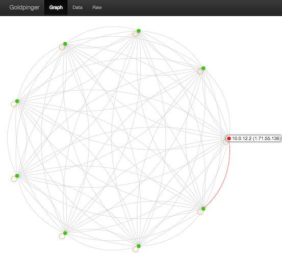
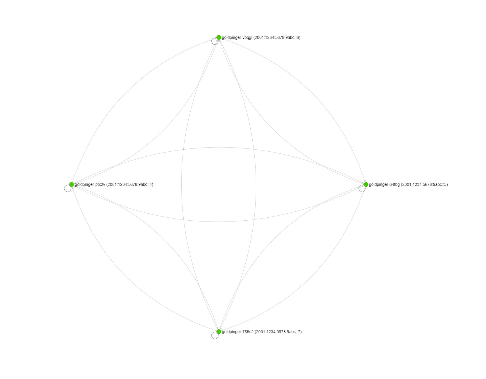
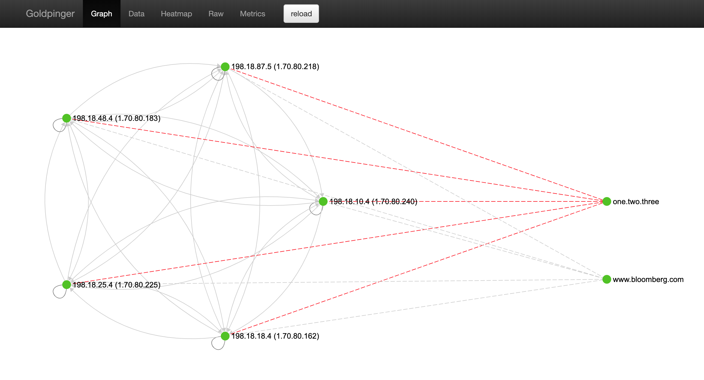
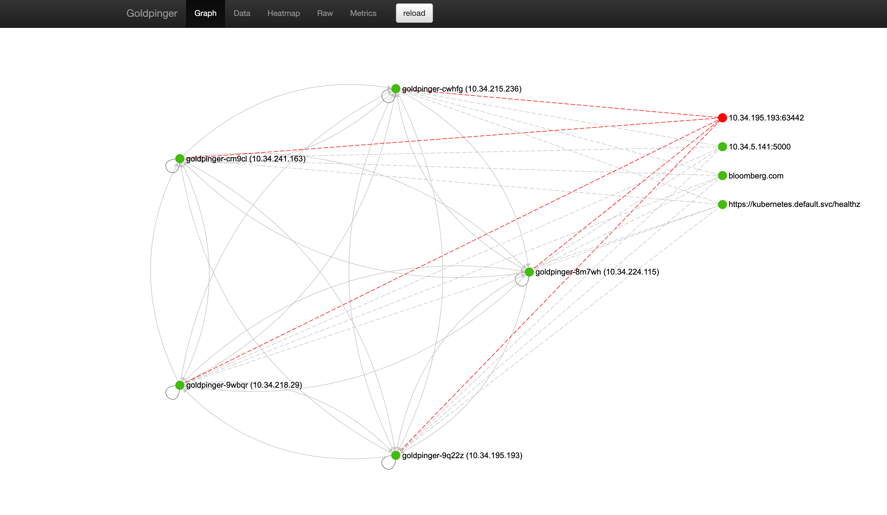
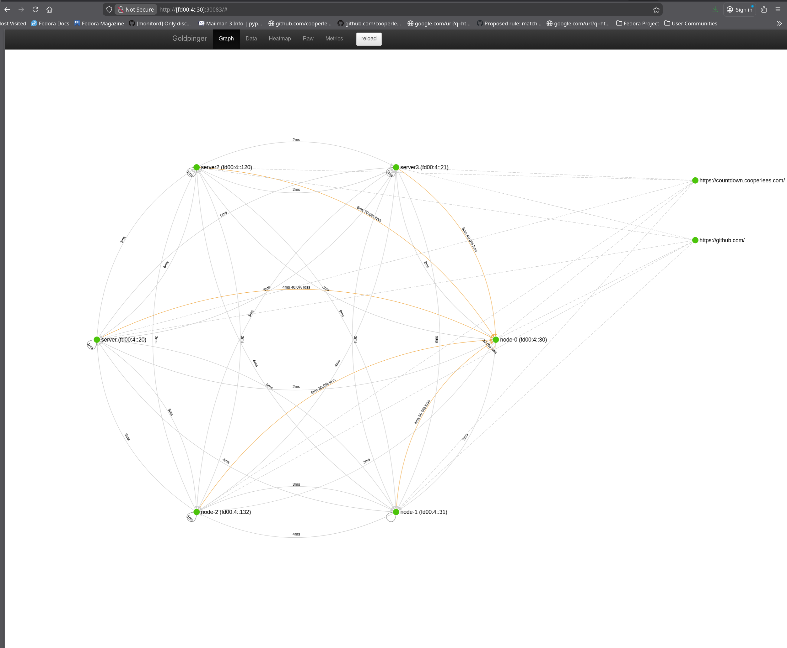
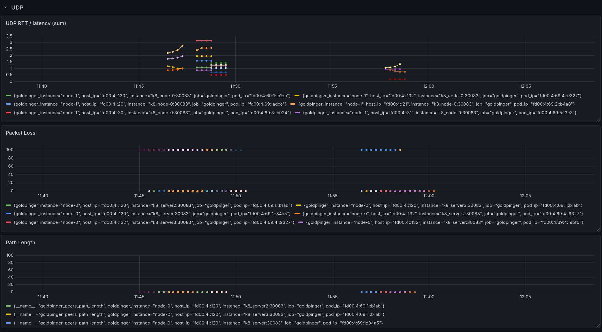
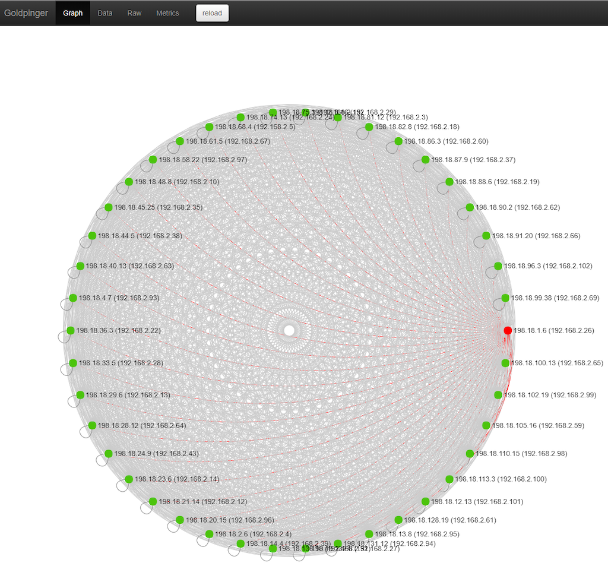

# Goldpinger

[](https://github.com/bloomberg/goldpinger/actions/workflows/publish.yml)
[](https://deepwiki.com/bloomberg/goldpinger)

__Goldpinger__ makes calls between its instances to monitor your networking.
It runs as a [`DaemonSet`](#example-yaml) on `Kubernetes` and produces `Prometheus` metrics that can be [scraped](#prometheus), [visualised](#grafana) and [alerted](#alert-manager) on.

Oh, and it gives you the graph below for your cluster. Check out the [video explainer](https://youtu.be/DSFxRz_0TU4).



[:tada: 1M+ pulls from docker hub!](https://hub.docker.com/r/bloomberg/goldpinger/tags)

## On the menu

- [Goldpinger](#goldpinger)
  - [On the menu](#on-the-menu)
  - [Rationale](#rationale)
  - [Quick start](#quick-start)
  - [Building](#building)
    - [Compiling using a multi-stage Dockerfile](#compiling-using-a-multi-stage-dockerfile)
    - [Compiling locally](#compiling-locally)
  - [Installation](#installation)
    - [Authentication with Kubernetes API](#authentication-with-kubernetes-api)
    - [Example YAML](#example-yaml)
    - [Note on DNS](#note-on-dns)
    - [UDP probe for packet loss, hop count, and RTT](#udp-probe-for-packet-loss-hop-count-and-rtt)
    - [Active/passive node sharding](#activepassive-node-sharding)
  - [Usage](#usage)
    - [UI](#ui)
    - [API](#api)
    - [Prometheus](#prometheus)
    - [Grafana](#grafana)
    - [Alert Manager](#alert-manager)
    - [Chaos Engineering](#chaos-engineering)
  - [Authors](#authors)
  - [Contributions](#contributions)
  - [License](#license)

## Rationale

We built __Goldpinger__ to troubleshoot, visualise and alert on our networking layer while adopting `Kubernetes` at Bloomberg. It has since become the go-to tool to see connectivity and slowness issues.

It's small (~16MB), simple and you'll wonder why you hadn't had it before.

If you'd like to know more, you can watch [our presentation at Kubecon 2018 Seattle](https://youtu.be/DSFxRz_0TU4).

## Quick start

Getting from sources:

```sh
go get github.com/bloomberg/goldpinger/cmd/goldpinger
goldpinger --help
```

Getting from [docker hub](https://hub.docker.com/r/bloomberg/goldpinger):

```sh
# get from docker hub
docker pull bloomberg/goldpinger:v3.0.0
```

## Building

The repo comes with two ways of building a `docker` image: compiling locally, and compiling using a multi-stage `Dockerfile` image. :warning: Depending on your `docker` setup, you might need to prepend the commands below with `sudo`.

### Compiling using a multi-stage Dockerfile

You will need `docker` version 17.05+ installed to support multi-stage builds.

```sh
# Build a local container without publishing
make build

# Build & push the image somewhere
namespace="docker.io/myhandle/" make build-release
```

This was contributed via [@michiel](https://github.com/michiel) - kudos !

### Compiling locally

In order to build `Goldpinger`, you are going to need `go` version 1.15+ and `docker`.

Building from source code consists of compiling the binary and building a [Docker image](./Dockerfile):

```sh
# step 0: check out the code
git clone https://github.com/bloomberg/goldpinger.git
cd goldpinger

# step 1: compile the binary for the desired architecture
make bin/goldpinger
# at this stage you should be able to run the binary
./bin/goldpinger --help

# step 2: build the docker image containing the binary
namespace="docker.io/myhandle/" make build

# step 3: push the image somewhere
docker push $(namespace="docker.io/myhandle/" make version)
```

## Installation
`Goldpinger` works by asking `Kubernetes` for pods with particular labels (`app=goldpinger`). While you can deploy `Goldpinger` in a variety of ways, it works very nicely as a `DaemonSet` out of the box.

### Helm Installation
Goldpinger can be installed via [Helm](https://helm.sh/) using the following:

```
helm repo add goldpinger https://bloomberg.github.io/goldpinger
helm repo update
helm install goldpinger goldpinger/goldpinger
```

### Manual Installation
`Goldpinger` can be installed manually via configuration similar to the following:

#### Authentication with Kubernetes API

`Goldpinger` supports using a `kubeconfig` (specify with `--kubeconfig-path`) or service accounts.

#### Example YAML

Here's an example of what you can do (using the in-cluster authentication to `Kubernetes` apiserver).

```yaml
---
apiVersion: v1
kind: ServiceAccount
metadata:
  name: goldpinger-serviceaccount
  namespace: default
---
apiVersion: apps/v1
kind: DaemonSet
metadata:
  name: goldpinger
  namespace: default
  labels:
    app: goldpinger
spec:
  updateStrategy:
    type: RollingUpdate
  selector:
    matchLabels:
      app: goldpinger
  template:
    metadata:
      annotations:
        prometheus.io/scrape: 'true'
        prometheus.io/port: '8080'
      labels:
        app: goldpinger
    spec:
      serviceAccount: goldpinger-serviceaccount
      tolerations:
        - key: node-role.kubernetes.io/master
          effect: NoSchedule
      securityContext:
        runAsNonRoot: true
        runAsUser: 1000
        fsGroup: 2000
      containers:
        - name: goldpinger
          env:
            - name: HOST
              value: "0.0.0.0"
            - name: PORT
              value: "8080"
            # injecting real hostname will make for easier to understand graphs/metrics
            - name: HOSTNAME
              valueFrom:
                fieldRef:
                  fieldPath: spec.nodeName
            # podIP is used to select a randomized subset of nodes to ping.
            - name: POD_IP
              valueFrom:
                fieldRef:
                  fieldPath: status.podIP
          image: "docker.io/bloomberg/goldpinger:v3.0.0"
          imagePullPolicy: Always
          securityContext:
            allowPrivilegeEscalation: false
            readOnlyRootFilesystem: true
          resources:
            limits:
              memory: 80Mi
            requests:
              cpu: 1m
              memory: 40Mi
          ports:
            - containerPort: 8080
              name: http
          readinessProbe:
            httpGet:
              path: /healthz
              port: 8080
            initialDelaySeconds: 20
            periodSeconds: 5
          livenessProbe:
            httpGet:
              path: /healthz
              port: 8080
            initialDelaySeconds: 20
            periodSeconds: 5
---
apiVersion: v1
kind: Service
metadata:
  name: goldpinger
  namespace: default
  labels:
    app: goldpinger
spec:
  type: NodePort
  ports:
    - port: 8080
      nodePort: 30080
      name: http
  selector:
    app: goldpinger
```

Note, that you will also need to add an RBAC rule to allow `Goldpinger` to list other pods. If you're just playing around, you can consider a view-all default rule:

```yaml
---
apiVersion: rbac.authorization.k8s.io/v1
kind: ClusterRoleBinding
metadata:
  name: default
roleRef:
  apiGroup: rbac.authorization.k8s.io
  kind: ClusterRole
  name: view
subjects:
  - kind: ServiceAccount
    name: goldpinger-serviceaccount
    namespace: default
```

You can also see [an example of using `kubeconfig` in the `./extras`](./extras/example-with-kubeconfig.yaml).

### Using with IPv4/IPv6 dual-stack

If your cluster IPv4/IPv6 dual-stack and you want to force IPv6, you can set the `IP_VERSIONS` environment variable to "6" (default is "4") which will use the IPv6 address on the pod and host.



### Note on DNS

Note, that on top of resolving the other pods, all instances can also try to resolve arbitrary DNS. This allows you to test your DNS setup.

From `--help`:

```sh
--host-to-resolve=      A host to attempt dns resolve on (space delimited) [$HOSTS_TO_RESOLVE]
```

So in order to test two domains, we could add an extra env var to the example above:

```yaml
            - name: HOSTS_TO_RESOLVE
              value: "www.bloomberg.com one.two.three"
```

and `goldpinger` should show something like this:



### TCP and HTTP checks to external targets

Instances can also be configured to do simple TCP or HTTP checks on external targets. This is useful for visualizing more nuanced connectivity flows.

```sh
      --tcp-targets=             A list of external targets(<host>:<port> or <ip>:<port>) to attempt a TCP check on (space delimited) [$TCP_TARGETS]
      --http-targets=            A  list of external targets(<http or https>://<url>) to attempt an HTTP{S} check on. A 200 HTTP code is considered successful. (space delimited) [$HTTP_TARGETS]
      --tcp-targets-timeout=  The timeout for a tcp check on the provided tcp-targets (default: 500) [$TCP_TARGETS_TIMEOUT]
      --dns-targets-timeout=  The timeout for a tcp check on the provided udp-targets (default: 500) [$DNS_TARGETS_TIMEOUT]
```

```yaml
        - name: HTTP_TARGETS
          value: http://bloomberg.com
        - name: TCP_TARGETS
          value: 10.34.5.141:5000 10.34.195.193:6442
```

the timeouts for the TCP, DNS and HTTP checks can be configured via `TCP_TARGETS_TIMEOUT`, `DNS_TARGETS_TIMEOUT` and `HTTP_TARGETS_TIMEOUT` respectively.



### UDP probe for packet loss, hop count, and RTT

In natively routed Kubernetes environments (e.g. Cilium, Calico in BGP mode), the existing HTTP ping can mask network issues: TCP retransmits hide packet loss, and HTTP latency includes the 3-way handshake, TLS, and application overhead. The UDP probe gives you visibility into the actual network layer.

When enabled, each goldpinger pod runs a UDP echo listener. During each ping cycle, the prober sends a configurable number of sequenced UDP packets to each peer; the peer echoes them back. From the replies, goldpinger computes:

- **Packet loss** — percentage of packets that were not returned, surfacing degraded links before they impact applications
- **Hop count** — estimated from the IPv4 TTL or IPv6 HopLimit on received replies, useful for detecting asymmetric routing or unexpected topology changes
- **UDP RTT** — average round-trip time with sub-millisecond precision, isolating network latency from TCP/HTTP overhead

The feature is disabled by default and can be enabled with the following environment variables:

```sh
UDP_ENABLED=true        # enable UDP probing and echo listener
UDP_PORT=6969           # listener port (default: 6969)
UDP_PACKET_COUNT=10     # packets per probe (default: 10)
UDP_PACKET_SIZE=64      # bytes per packet (default: 64)
UDP_TIMEOUT=1s          # probe timeout (default: 1s)
```

Or via the Helm chart:

```yaml
goldpinger:
  udp:
    enabled: true
    port: 6969
```

This adds three Prometheus metrics:

```sh
goldpinger_peers_loss_pct          # gauge: UDP packet loss percentage (0-100)
goldpinger_peers_hop_count         # gauge: estimated hop count
goldpinger_peers_udp_rtt_s         # histogram: UDP round-trip time in seconds
goldpinger_udp_errors_total        # counter: UDP probe errors
goldpinger_udp_duplicates_total    # counter: duplicate UDP reply packets
goldpinger_udp_out_of_order_total  # counter: out-of-order UDP reply packets
```

Links with partial loss are shown as yellow edges in the graph UI, and edge labels display the UDP RTT instead of HTTP latency when available.





No new dependencies are required (`golang.org/x/net` is already in go.mod), and no additional container capabilities are needed.

### Active/passive node sharding

At scale, every goldpinger pod list-watches all pods via the Kubernetes API server. With hundreds or thousands of nodes, this creates N concurrent list-watches that can overwhelm the API server and trigger cascading failures.

Active/passive sharding lets you configure a percentage of nodes as **active** (list-watch + ping peers) while the rest are **passive** (only respond to `/ping`). Active nodes still ping passive nodes, so connectivity is validated across the entire cluster with a fraction of the API server load.

#### Configuration

| Method | Example |
|--------|---------|
| Env var | `ACTIVE_NODE_PERCENTAGE=10` |
| CLI flag | `--active-node-percentage=10` |
| Helm | `goldpinger.activeNodePercentage: 10` |

The default is `100` (all nodes active) — fully backwards compatible.

#### Forcing specific nodes active

For small clusters or when you need a guarantee that specific nodes are always active:

| Method | Example |
|--------|---------|
| Env var | `ACTIVE_NODES=node-1,node-2` |
| CLI flag | `--active-nodes=node-1,node-2` |
| Helm | `goldpinger.activeNodes: [node-1, node-2]` |

Nodes in this list are always active, regardless of the percentage hash.

> **Note for small clusters:** The hash-based percentage is probabilistic. With fewer than ~20 nodes and a low percentage, it's possible all nodes hash into the passive range. Use `ACTIVE_NODES` to guarantee at least one active node.

#### How it works

Each pod hashes its own node name (from `spec.nodeName`) using FNV-1a and checks if `hash % 100 < percentage`. This is deterministic — the same node always gets the same role across restarts, with no inter-pod coordination.

> **Mode is evaluated once at startup and never changes while the pod is running.** To change a node from passive to active (or vice versa), update the configuration and perform a **DaemonSet rolling restart** (`kubectl rollout restart daemonset/goldpinger`). This design is intentional: it means passive nodes make zero API server calls for their entire lifetime, which is ideal for large clusters.


#### Behavior by mode

| Endpoint | Active | Passive |
|----------|--------|---------|
| `GET /ping` | 200 | 200 |
| `GET /healthz` | 200 | 200 |
| `GET /metrics` | Full metrics | Mode metric only |
| `GET /check` | 200 | 503 |
| `GET /check_all` | 200 | 503 |
| `GET /cluster_health` | 200 | 503 |

Passive nodes skip Kubernetes client creation entirely — no list-watch, no API server load.

#### Monitoring

The `goldpinger_node_mode` Prometheus metric indicates the node's mode: `1` for active, `0` for passive. You can use this to verify your sharding configuration:

```promql
# Count active vs passive nodes
count(goldpinger_node_mode == 1)  # active nodes
count(goldpinger_node_mode == 0)  # passive nodes
```

#### Example: 1000-node cluster

| Config | API server list-watches | Nodes pinged |
|--------|------------------------|--------------|
| Default (100%) | 1000 | 1000 |
| 10% | ~100 | 1000 |
| 1% | ~10 | 1000 |

## Usage

### UI

Once you have it running, you can hit any of the nodes (port 30080 in the example above) and see the UI.



You can click on various nodes to gray out the clutter and see more information.

### API

The API exposed is via a well-defined [`Swagger` spec](./swagger.yml).

The spec is used to generate both the server and the client of `Goldpinger`. If you make changes, you can re-generate them using [go-swagger](https://github.com/go-swagger/go-swagger) via [`make swagger`](./Makefile)

### Prometheus

Once running, `Goldpinger` exposes `Prometheus` metrics at `/metrics`. All the metrics are prefixed with `goldpinger_` for easy identification.

You can see the metrics by doing a `curl http://$POD_ID:80/metrics`.

These are probably the droids you are looking for:

```sh
goldpinger_peers_response_time_s_*
goldpinger_nodes_health_total
goldpinger_stats_total
goldpinger_errors_total
goldpinger_peers_loss_pct           # (UDP probe, when enabled)
goldpinger_peers_hop_count          # (UDP probe, when enabled)
goldpinger_peers_udp_rtt_s_*        # (UDP probe, when enabled)
goldpinger_udp_duplicates_total     # (UDP probe, when enabled)
goldpinger_udp_out_of_order_total   # (UDP probe, when enabled)
goldpinger_node_mode                # 1 = active, 0 = passive (active/passive sharding)
```

### Grafana

You can find an example of a `Grafana` dashboard that shows what's going on in your cluster in [extras](./extras/goldpinger-dashboard.json). This should get you started, and once you're on the roll, why not :heart: contribute some kickass dashboards for others to use ?

### Alert Manager

Once you've gotten your metrics into `Prometheus`, you have all you need to set useful alerts.

To get you started, here's a rule that will trigger an alert if there are any nodes reported as unhealthy by any instance of `Goldpinger`.

```yaml
alert: goldpinger_nodes_unhealthy
expr: sum(goldpinger_nodes_health_total{status="unhealthy"})
  BY (instance, goldpinger_instance) > 0
for: 5m
annotations:
  description: |
    Goldpinger instance {{ $labels.goldpinger_instance }} has been reporting unhealthy nodes for at least 5 minutes.
  summary: Instance {{ $labels.instance }} down
```

Similarly, why not :heart: contribute some amazing alerts for others to use ?

### Chaos Engineering

Goldpinger also makes for a pretty good monitoring tool in when practicing Chaos Engineering. Check out [PowerfulSeal](https://github.com/bloomberg/powerfulseal), if you'd like to do some Chaos Engineering for Kubernetes.

## Authors

Goldpinger was created by [Mikolaj Pawlikowski](https://github.com/seeker89) and ported to Go by Chris Green.


## Contributions

We :heart: contributions.

Have you had a good experience with `Goldpinger` ? Why not share some love and contribute code, dashboards and alerts ?

If you're thinking of making some code changes, please be aware that most of the code is auto-generated from the `Swagger` spec. The spec is used to generate both the server and the client of `Goldpinger`. If you make changes, you can re-generate them using [go-swagger](https://github.com/go-swagger/go-swagger) via [`make swagger`](./Makefile).

Before you create that PR, please make sure you read [CONTRIBUTING](./CONTRIBUTING.md) and [DCO](./DCO.md).

## License

Please read the [LICENSE](./LICENSE) file here.

For each version built by travis, there is also an additional version, appended with `-vendor`, which contains all source code of the dependencies used in `goldpinger`.
